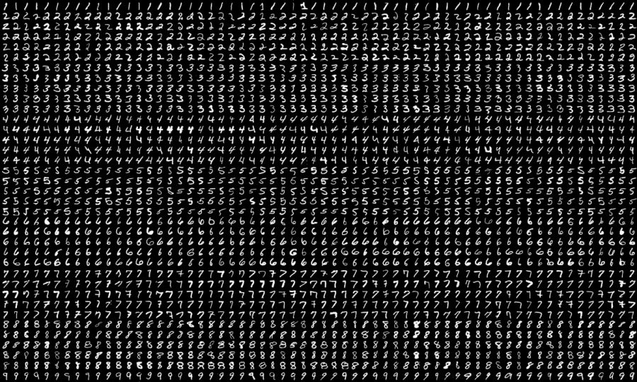

# Digit-Recognition-Using-MNIST-Dataset
This model is trained using CNN and recognize hand written digits with the accuracy of 99.5%

### History of Handwritten Digit dataset
Modified National Institute of Standards and Technology database (MNIST dataset) is a large dataset of handwritten digits which is widely used in image processing and machine learning. The set of images in the MNIST database is a combination of two of NIST's databases: Special Database 1 and Special Database 3. Special Database 1 and Special Database 3 consist of digits written by high school students and employees of the United States Census Bureau, respectively.

## Building Model

### Model Using Keras
There are two different ways of defining the Model in Keras:

* Sequential Model
* Function API
Functional API is used to build a more complicated Model such as for multi-output Models, directed acyclic graphs, or models with shared layers. I am using the Sequential Model in this notebook to keep things simple.
In Sequential Model, you can add each layer sequentially.

<b>Description of Model:</b>

* 2 Convolutional Blocks
Each block consists of 2 Conv2D layers with LeakyRelU activation layers. Then a MaxPool2D layer and finally a Dropout Layer.

* Then Dense Layers and Output layer after Flatten layer.
* MaxPool2D layer is used to reduce the size of the image. Pool size (2,2) means reducing the image from (28,28) to (14,14). Reducing the features.
* Dropout layer drops the few activation nodes while training, which acts as regularization. Do let the model to over-fit.
* Output layer has 10 nodes with sigmoid activation.

## Improving Result by Image Augmentation

A deep network requires extensive data to achieve decent performance. To build a good classifier with small training data, image augmentation can solve the problem to a greater extend. Image augmentation generates images by different ways of processing, such as random shift, rotation, flips, etc.
### Augmentation Using Keras
Here I used the ImageDataGenerator() function of Keras for Image augmentation. Parameters to use:

* <b>rotation_range:</b> randomly rotate images in the range (degrees, 0 to 180)
* <b>zoom_range:</b> Randomly zoom image
* <b>width_shift_range:</b> randomly shift images horizontally (fraction of total width)
* <b>height_shift_range:</b> randomly shift images vertically (fraction of total height)
* <b>horizontal_flip:</b> randomly flip images (Can't be used in this case as it changes the digit)
* <b>vertical_flip:</b> randomly flip images (Can't be used in this case as it changes the digit)

## Accuracy and Loss curve

